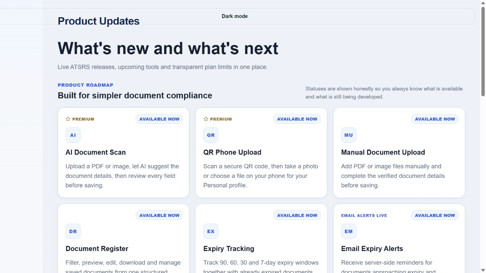
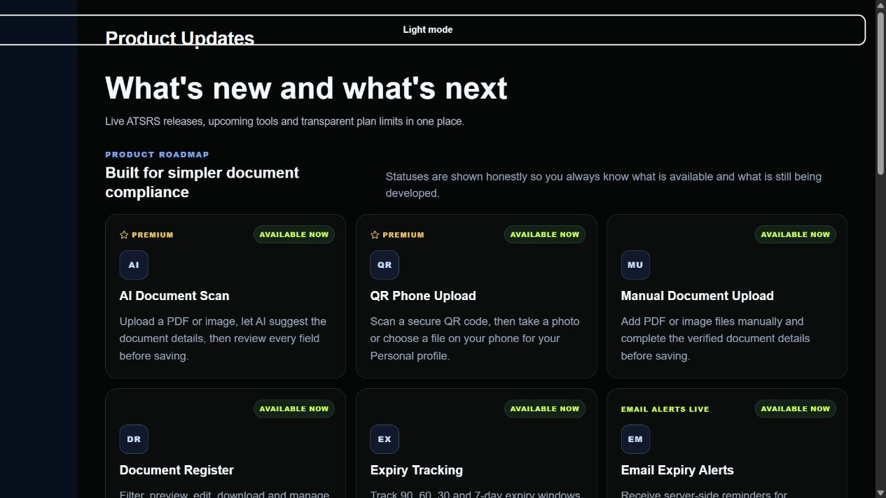
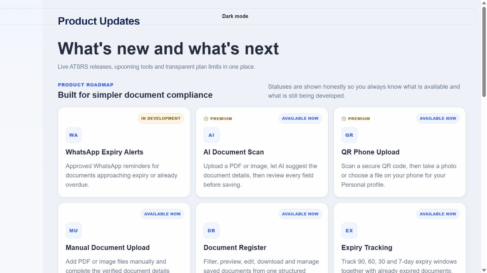
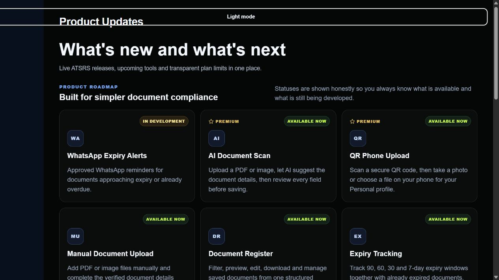

# ATSRS Product Updates Light/Dark Audit — V544

## Audit scope

- Surface: production-matched authenticated Personal and Corporate Product Updates fixture using the live application styles and content.
- Goal: preserve theme colors while making layout, dimensions and text flow identical between Light and Dark modes.
- Capture viewport: desktop, 1265 × 712.

## Step 1 — Light mode before

- Strength: clean hierarchy and aligned card content.
- Risk: its 16 px grid gap, 40 px icons, 11 px statuses and 14 px roadmap description did not match Dark mode.

## Step 2 — Dark mode before

- Strength: restrained surfaces and clear semantic statuses.
- Risk: the roadmap title wrapped to two lines because the description consumed too much width. Cards used a 14 px gap, 42 px icons and 10 px statuses, creating visible theme switching movement.

## Step 3 — Light mode after

- Geometry now follows the shared Dark-oriented contract: 14 px grid gap, 42 px icons, 10 px statuses, 20 px card padding and 17 px radius.
- Roadmap description uses the same 520 px width, 16 px size and 24 px line height as Dark mode.

## Step 4 — Dark mode after

- The roadmap title remains on one line at this viewport.
- Card widths, heights, internal rows, icon sizes, title sizes, body copy and status placement match Light mode exactly.

## Accessibility and evidence limits

- Visible hierarchy, contrast risk, alignment and reflow rules were reviewed.
- Keyboard and assistive-technology behavior was not changed by this visual-only patch.
- Screenshot evidence does not by itself establish complete WCAG compliance.

## Result

- Measured theme parity: card 348.22 × 238 px; icon 42 × 42 px; status 10 px with 5 × 8 px padding; grid gap 14 px; roadmap description 520 × 48 px in both themes.
- Focused regression suite: 17/17 passed.
- Final result: passed.
